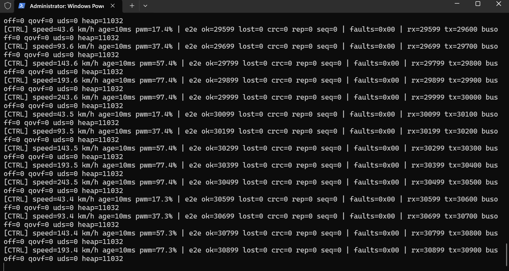

# Mini Automotive ECU Network with UDS Diagnostics

A scaled-down model of an in-vehicle network: several ECUs talk over CAN, detect faults,
store diagnostic trouble codes (DTCs) and answer a diagnostic tester using **UDS (ISO 14229)**
over **ISO-TP (ISO 15765-2)**.

> 🚧 Work in progress. See [Roadmap](#roadmap) for current status.
>
> 📄 Technical report (interim, milestones M1–M2): [docs/report/main.pdf](docs/report/main.pdf)

## System overview

```
 ┌──────────────────┐        CAN 500 kbit/s (Classic 2.0A)        ┌────────────────────────┐
 │  Sensor ECU      │═════════╦══════════════════════╦═════════════│  Control ECU           │
 │  NUCLEO-G431RB   │  0x100  ║                      ║  0x7E8      │  STM32MP157 Cortex-M4  │
 │  pot → ADC → CAN │  0x101  ║                      ║             │  FreeRTOS, DTC, UDS    │
 └──────────────────┘         ║                      ║             └────────────────────────┘
                              ║  0x7E0               ║
                     ┌────────╨──────────────────────╨───┐
                     │  Diagnostic Tester                │
                     │  Linux (Cortex-A7) + SocketCAN    │
                     │  Python UDS client, can-utils     │
                     └───────────────────────────────────┘
```

| Node | Hardware | Role |
|---|---|---|
| Sensor ECU | NUCLEO-G431RB + SN65HVD230 | Samples a potentiometer (simulated vehicle speed), sends it every 10 ms |
| Control ECU | STM32MP157D-DK1, Cortex-M4 | Receives data, drives outputs, monitors faults, stores DTCs, UDS server |
| Tester | STM32MP157D-DK1, Cortex-A7 (Linux) / PC + USB-CAN | Sends UDS requests, reads/clears DTCs |

## CAN matrix

| ID | Sender → Receiver | Cycle | Content |
|---|---|---|---|
| `0x100` | Sensor → bus | 10 ms | Speed (0.1 km/h), raw ADC, status, alive counter, CRC-8 |
| `0x101` | Sensor → bus | 100 ms | Node state, uptime, bus-off count, alive counter, CRC-8 |
| `0x200` | Control ECU → bus | 100 ms | active faults, confirmed DTC count, output duty, alive counter, CRC-8 |
| `0x7E0` | Tester → Control ECU | on request | UDS request |
| `0x7E8` | Control ECU → Tester | on request | UDS response |

Signal-level layout: [`sensor_ecu/Core/App/can_matrix.h`](sensor_ecu/Core/App/can_matrix.h).
Cyclic frames carry an alive counter and a CRC-8 SAE-J1850 (same as AUTOSAR E2E Profile 1)
so the receiver can detect lost, repeated or corrupted frames.

**Bit timing:** 500 kbit/s, FDCAN kernel clock 170 MHz (from 24 MHz HSE crystal),
prescaler 10, 34 tq/bit (Seg1 29, Seg2 4, SJW 4) → sample point ≈ 88 %.

## Software architecture

Layered, AUTOSAR-inspired. Only the MCAL layer touches the HAL/registers.

```
Application    sensor_app / control_app
Services       uds_server, dtc_manager           (hardware independent)
Communication  isotp, e2e, crc8, can_matrix      (hardware independent)
MCAL           can_drv, adc_drv, gpio_drv, pwm_drv
```

Hardware-independent modules (ISO-TP, UDS, DTC manager) are plain C so they can be unit
tested on a PC.

## UDS services (Control ECU, physical 0x7E0 / functional 0x7DF -> 0x7E8)

| SID | Service | Implemented |
|---|---|---|
| `0x10` | Diagnostic Session Control | `01` default, `03` extended; P2 = 50 ms, P2* = 5 s, S3 = 5 s |
| `0x11` | ECU Reset | `01` hard (core reset, not yet exercised on hardware), `03` soft (new operation cycle); extended session only |
| `0x14` | Clear Diagnostic Information | group `FFFFFF` |
| `0x19` | Read DTC Information | `01` number of DTCs by status mask, `02` DTCs by status mask |
| `0x22` | Read Data By Identifier | `F195` SW version, `0100` speed, `0101` active faults; several DIDs per request |
| `0x3E` | Tester Present | `00`, with suppress-positive-response bit |

Negative responses `0x11`, `0x12`, `0x13`, `0x14`, `0x31`, `0x7E`, `0x7F`; for functional
requests the NRCs required by ISO 14229 are suppressed.

| Fault (monitor) | DTC | Confirmed after |
|---|---|---|
| Speed signal timeout | `U0100-87` (`C10087`) | 1 failed cycle |
| Speed out of range | `P0501-00` (`050100`) | 3 consecutive cycles |
| E2E error on 0x100 | `U0400-81` (`C40081`) | 3 |
| Sensor ADC error | `P0500-96` (`050096`) | 3 |
| Local output fault (USER1) | `B1A00-11` (`9A0011`) | 3 |

DTC status bits follow ISO 14229-1 Annex D (availability mask `0x7F`). Codes use the SAE J2012
layout; the mapping is project specific.

## Repository layout

```
sensor_ecu/          STM32CubeIDE project, NUCLEO-G431RB
  Core/Mcal/         can_drv, adc_drv, gpio_drv
  Core/App/          sensor_app, can_matrix.h, crc8
control_ecu/CM4/     STM32MP157 Cortex-M4 firmware (FreeRTOS), loaded by Linux remoteproc
common/can/          CAN matrix shared by all nodes
common/e2e/          alive counter + CRC-8 protection (sender and receiver)
common/isotp/        ISO 15765-2 transport layer (SF/FF/CF/FC, BS, STmin, N_Bs/N_Cr timeouts)
common/uds/          UDS server (ISO 14229-1)
common/dtc/          DTC manager with ISO 14229 status bits
tests/               host unit tests (make)
tester/              (planned) Python UDS client (SocketCAN)
```

## Wiring (verified)

| Signal | NUCLEO-G431RB | SN65HVD230 | STM32MP157D-DK1 |
|---|---|---|---|
| FDCAN1_TX | PA12 = CN10 pin 12 (morpho) | CTX | PA12 = CN13 pin 9 (Arduino D14) |
| FDCAN1_RX | PA11 = CN10 pin 14 (morpho) | CRX | PA11 = CN13 pin 10 (Arduino D15) |
| Supply | 3V3 / GND (CN6) | 3V3 / GND | 3V3 = CN16 pin 4, GND = CN16 pin 6 |

Bus: CANH–CANH, CANL–CANL (twisted pair) and a common GND between both boards.
Each module carries a 120 Ω terminator, so CANH–CANL measures about 60 Ω with both connected.
On the DK1 use D14/D15 on CN13, not A4/A5; the same signals are also on the 40-pin CN2 (pins 3 and 5).

## Building and running the Sensor ECU

1. STM32CubeIDE → *File → Import → Existing Projects into Workspace* → select `sensor_ecu/`.
2. Build, then flash with the on-board ST-LINK.
3. Open the ST-LINK virtual COM port at 115200 8N1. A status line is printed every second:
   ```
   [SENSOR] speed=123.4 km/h adc=2021 mode=0 | tx=110 drop=0 rx=110 rx100=100 busoff=0
   ```

`SENSOR_APP_CAN_LOOPBACK` in `sensor_app.c` selects FDCAN internal loopback (no transceiver
needed) or normal mode (real bus).

**Fault injection:** the blue user button B1 cycles through
`NONE` → `SILENT` (stop sending 0x100, triggers timeout DTC) → `OUT_OF_RANGE` (300 km/h, triggers range DTC).

## Unit tests

Hardware-independent modules are tested on the PC with fake CAN driver and clock:

```
cd tests
make          # needs gcc (Linux, or MSYS2 UCRT64 on Windows)
```

## Static analysis (cppcheck + MISRA C:2012)

```
tools/static_analysis.sh      # cppcheck 2.x with the MISRA addon, exit 1 on findings
```

All project code (`common/`, App and MCAL layers of both ECUs) passes with **no findings**.
Nine rule violations were fixed in the code; the five remaining deviations are documented in
[docs/misra_deviations.md](docs/misra_deviations.md).

## Milestones

### M1 — Sensor ECU bring-up (FDCAN internal loopback) ✅

NUCLEO-G431RB samples the potentiometer and publishes `0x100` (10 ms) and `0x101` (100 ms).
In FDCAN internal loopback the controller receives its own frames, which verifies bit-timing
configuration, acceptance filter, RX interrupt and frame packing without a transceiver.


| Check | Result |
|---|---|
| TX rate | 110 frames/s (100 × `0x100` + 10 × `0x101`) as designed |
| RX in loopback | every `0x100` received back (`rx100` +100/s) |
| Long run | 59 000+ frames, 0 dropped, 0 bus-off |
| ADC | full sweep follows the potentiometer, ±1–2 LSB noise at rest |
| Fault injection (B1) | pending hardware check |

### M2 — Control ECU bring-up on the STM32MP157 Cortex-M4 (FDCAN internal loopback) ✅

The M4 firmware is loaded by Linux (remoteproc). In loopback it plays the Sensor ECU
(speed ramp 0–250 km/h) so the full receive chain is exercised on the DK1 alone:
FDCAN ISR → RTOS queue → E2E check → fault monitor → PWM output.



| Check | Result |
|---|---|
| Throughput | 100 frames/s received, `rx = tx − 1` (last frame in flight) |
| Long run | 30 900 frames, 0 CRC / 0 lost / 0 repeated / 0 sequence errors |
| RTOS | 0 queue overflows, 11 KB of 16 KB heap free |
| Output | PWM follows speed (e.g. 193.4 km/h → 77.3 %), no active faults |
| Bring-up fixes | FreeRTOS SysTick handler, FDCAN glitch-free clock mux (see below) |

### M3 — UDS diagnostics and DTC management on the Control ECU (FDCAN internal loopback) ✅

A second ISO-TP link on the M4 plays the tester (TX 0x7E0, RX 0x7E8, BS 2, STmin 1 ms) and runs
14 UDS requests over the CAN controller, checking every response. Full log:
[docs/logs/m3_uds_selftest.log](docs/logs/m3_uds_selftest.log)

```
[TEST]  2/14 ReadDID F195 (ECU sends FF+CF)   PASS
[TEST]  3/14 ReadDID x4 (ECU receives FF+CF)  PASS
[TEST]  6/14 Reset in default -> NRC 7E       PASS
[CTRL] fault OUTPUT_LOCAL  SET
[TEST]  9/14 Confirmed DTCs = 1               PASS
[TEST] 10/14 DTC list B1A00-11 0x2F           PASS
[TEST] 11/14 Clear all DTCs                   PASS
[TEST] UDS self-test finished: 14/14 passed
```

Sensor data kept flowing during the test with 0 E2E errors and 0 queue overflows.

### M4 — Two-node CAN bus with fault injection ✅

NUCLEO-G431RB and STM32MP157D-DK1 on a real bus through two SN65HVD230 transceivers.
65 s capture of both ECUs, logs: [sensor](docs/logs/m4_bus_fault_injection_sensor.log),
[control](docs/logs/m4_bus_fault_injection_control.log)

| Time | Sensor ECU | Control ECU |
|---|---|---|
| 23–33 s | potentiometer sweep 142–233 km/h | speed and PWM follow |
| 39.7 s | B1 → `SILENT` (0x100 stopped) | 39.8 s `SPEED_TIMEOUT SET`, PWM 0 %, DTC U0100-87 |
| 46.7 s | B1 → `OUT_OF_RANGE` (300 km/h) | `SPEED_TIMEOUT cleared`, `SPEED_RANGE SET`, PWM 0 %, DTC P0501-00 |
| 55.6 s | B1 → normal | `SPEED_RANGE cleared`, PWM back to 64.5 %, DTCs retained |
| whole run | no dropped frame | 0 CRC / lost / repeated errors, 0 bus-off, 0 queue overflows |

Bring-up of the bus was diagnosed from the FDCAN error registers of both nodes: each node reading
back its own frames (LEC = ACK error) proved the MCU-transceiver wiring on each side, and putting the
DK1 into bus-monitoring (listen-only) mode proved that the bus polarity was correct.

## Bring-up notes (STM32MP157 Cortex-M4)

Issues found while bringing up the Control ECU in production mode (Linux on the A7
starts the M4 through remoteproc). Diagnosed by reading M4 RAM and peripheral
registers from Linux (`/dev/mem`), without a debugger.

| Symptom | Root cause | Fix |
|---|---|---|
| FreeRTOS hangs on the first tick (`xTickCount = 0`) | CubeMX sets `USE_CUSTOM_SYSTICK_HANDLER_IMPLEMENTATION = 1` but generates no `SysTick_Handler` when TIM7 is the HAL timebase, so SysTick lands in `Default_Handler` | Override to `0` in the USER CODE section of `FreeRTOSConfig.h` so `cmsis_os2.c` provides the handler |
| FDCAN never leaves INIT (`CCCR.INIT` stuck at 1, even when cleared from Linux) | Linux leaves the FDCAN kernel mux on PLL4_R with that PLL output disabled. Kernel muxes are glitch-free and only switch while *both* inputs run, so the switch to HSE never completed | `CanDrv_PrepareKernelClock()`: enable HSE kernel output, briefly enable the old PLL output during the switch, restore it afterwards, read back the result |

Known open points:
- HAL tick (TIM7) runs at 2 kHz in production mode: the timer clock set by Linux differs
  from the CubeMX assumption. The application uses the FreeRTOS tick (correct 1 kHz).
- M4 log goes to UART7 (Arduino D0/D1). A remoteproc trace buffer (log readable over SSH)
  is planned as a cable-free alternative.

## Roadmap

- [x] Sensor ECU: CubeMX setup (170 MHz from HSE, FDCAN 500 kbit/s, ADC, TIM6 10 ms tick)
- [x] Sensor ECU: MCAL drivers, cyclic 0x100/0x101 with alive counter + CRC, bus-off recovery
- [x] Sensor ECU: verified in FDCAN internal loopback (M1)
- [ ] Sensor ECU: verify on the real bus with a logic analyzer
- [x] Control ECU: M4 firmware on OpenSTLinux (remoteproc), FDCAN owned by M4, FreeRTOS tasks,
      E2E check, timeout/range faults, safe-state PWM — verified in FDCAN internal loopback
- [x] M3: UDS server + DTC manager on the Control ECU, 14/14 on-target UDS self-test in loopback
- [x] M4: two-node bus, 100 frames/s with 0 E2E errors, 0x200 status back to the Sensor ECU, fault injection -> DTCs
- [ ] Logic analyzer capture of bit timing on the bus
- [ ] External UDS tester on the bus (and hard reset test)
- [x] ISO-TP (SF, FF, CF, FC, block size, STmin, timeouts) with 26 host unit tests
- [x] UDS server with services above (11 host unit tests)
- [x] DTC manager (ISO 14229 status bits, debounce, operation cycle; 11 host unit tests)
- [ ] Python tester on Linux (SocketCAN)
- [x] Host unit tests: 56 tests / 277 checks (ISO-TP, E2E, DTC, UDS)
- [x] cppcheck + MISRA C:2012 addon: no findings, deviations documented
- [ ] Demo video
