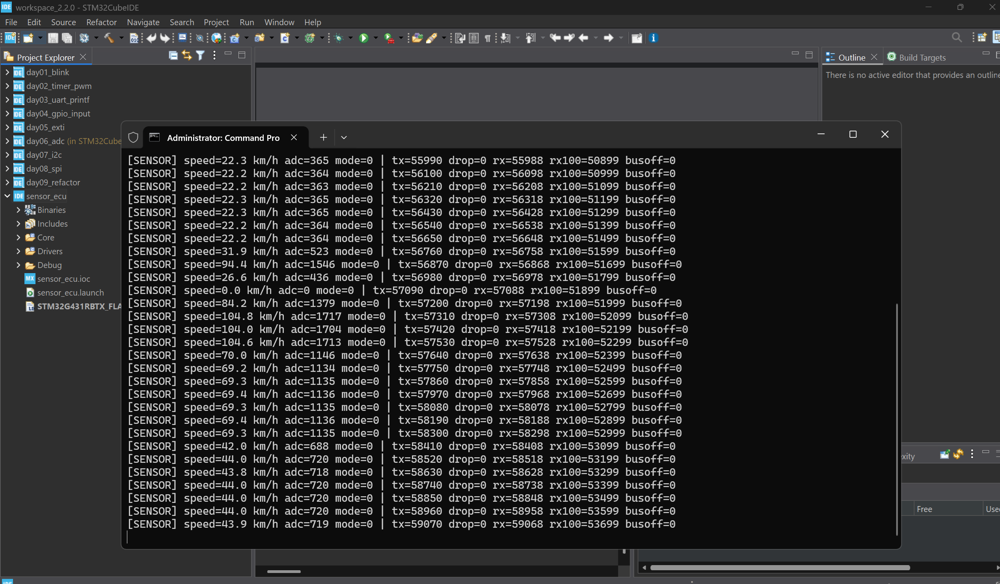

# Mini Automotive ECU Network with UDS Diagnostics

A scaled-down model of an in-vehicle network: several ECUs talk over CAN, detect faults,
store diagnostic trouble codes (DTCs) and answer a diagnostic tester using **UDS (ISO 14229)**
over **ISO-TP (ISO 15765-2)**.

> 🚧 Work in progress. See [Roadmap](#roadmap) for current status.

## System overview

```
 ┌──────────────────┐        CAN 500 kbit/s (Classic 2.0A)        ┌────────────────────────┐
 │  Sensor ECU      │═════════╦══════════════════════╦═════════════│  Control ECU           │
 │  NUCLEO-G431RB   │  0x100  ║                      ║  0x7E8      │  STM32MP157 Cortex-M4  │
 │  pot → ADC → CAN │  0x101  ║                      ║             │  FreeRTOS, DTC, UDS    │
 └──────────────────┘         ║                      ║             └────────────────────────┘
                              ║  0x7E0               ║
                     ┌────────╨──────────────────────╨───┐
                     │  Diagnostic Tester                │
                     │  Linux (Cortex-A7) + SocketCAN    │
                     │  Python UDS client, can-utils     │
                     └───────────────────────────────────┘
```

| Node | Hardware | Role |
|---|---|---|
| Sensor ECU | NUCLEO-G431RB + SN65HVD230 | Samples a potentiometer (simulated vehicle speed), sends it every 10 ms |
| Control ECU | STM32MP157D-DK1, Cortex-M4 | Receives data, drives outputs, monitors faults, stores DTCs, UDS server |
| Tester | STM32MP157D-DK1, Cortex-A7 (Linux) / PC + USB-CAN | Sends UDS requests, reads/clears DTCs |

## CAN matrix

| ID | Sender → Receiver | Cycle | Content |
|---|---|---|---|
| `0x100` | Sensor → bus | 10 ms | Speed (0.1 km/h), raw ADC, status, alive counter, CRC-8 |
| `0x101` | Sensor → bus | 100 ms | Node state, uptime, bus-off count, alive counter, CRC-8 |
| `0x7E0` | Tester → Control ECU | on request | UDS request |
| `0x7E8` | Control ECU → Tester | on request | UDS response |

Signal-level layout: [`sensor_ecu/Core/App/can_matrix.h`](sensor_ecu/Core/App/can_matrix.h).
Cyclic frames carry an alive counter and a CRC-8 SAE-J1850 (same as AUTOSAR E2E Profile 1)
so the receiver can detect lost, repeated or corrupted frames.

**Bit timing:** 500 kbit/s, FDCAN kernel clock 170 MHz (from 24 MHz HSE crystal),
prescaler 10, 34 tq/bit (Seg1 29, Seg2 4, SJW 4) → sample point ≈ 88 %.

## Software architecture

Layered, AUTOSAR-inspired. Only the MCAL layer touches the HAL/registers.

```
Application    sensor_app / control_app
Services       uds_server, dtc_manager           (planned, hardware independent)
Communication  isotp (done), can_if              (hardware independent)
MCAL           can_drv, adc_drv, gpio_drv, pwm_drv
```

Hardware-independent modules (ISO-TP, UDS, DTC manager) are plain C so they can be unit
tested on a PC.

## UDS services (planned)

| SID | Service |
|---|---|
| `0x10` | Diagnostic Session Control |
| `0x3E` | Tester Present |
| `0x22` | Read Data By Identifier (speed, firmware version) |
| `0x19` | Read DTC Information |
| `0x14` | Clear Diagnostic Information |
| `0x11` | ECU Reset |

Negative responses (e.g. NRC `0x11` serviceNotSupported, `0x31` requestOutOfRange) included.

## Repository layout

```
sensor_ecu/          STM32CubeIDE project, NUCLEO-G431RB
  Core/Mcal/         can_drv, adc_drv, gpio_drv
  Core/App/          sensor_app, can_matrix.h, crc8
control_ecu/CM4/     STM32MP157 Cortex-M4 firmware (FreeRTOS), loaded by Linux remoteproc
common/can/          CAN matrix shared by all nodes
common/e2e/          alive counter + CRC-8 protection (sender and receiver)
common/isotp/        ISO 15765-2 transport layer (SF/FF/CF/FC, BS, STmin, N_Bs/N_Cr timeouts)
common/              (planned) uds_server, dtc_manager
tests/               host unit tests (make)
tester/              (planned) Python UDS client (SocketCAN)
```

## Building and running the Sensor ECU

1. STM32CubeIDE → *File → Import → Existing Projects into Workspace* → select `sensor_ecu/`.
2. Build, then flash with the on-board ST-LINK.
3. Open the ST-LINK virtual COM port at 115200 8N1. A status line is printed every second:
   ```
   [SENSOR] speed=123.4 km/h adc=2021 mode=0 | tx=110 drop=0 rx=110 rx100=100 busoff=0
   ```

`SENSOR_APP_CAN_LOOPBACK` in `sensor_app.c` selects FDCAN internal loopback (no transceiver
needed) or normal mode (real bus).

**Fault injection:** the blue user button B1 cycles through
`NONE` → `SILENT` (stop sending 0x100, triggers timeout DTC) → `OUT_OF_RANGE` (300 km/h, triggers range DTC).

## Unit tests

Hardware-independent modules are tested on the PC with fake CAN driver and clock:

```
cd tests
make          # needs gcc (Linux, or MSYS2 UCRT64 on Windows)
```

## Milestones

### M1 — Sensor ECU bring-up (FDCAN internal loopback) ✅

NUCLEO-G431RB samples the potentiometer and publishes `0x100` (10 ms) and `0x101` (100 ms).
In FDCAN internal loopback the controller receives its own frames, which verifies bit-timing
configuration, acceptance filter, RX interrupt and frame packing without a transceiver.



| Check | Result |
|---|---|
| TX rate | 110 frames/s (100 × `0x100` + 10 × `0x101`) as designed |
| RX in loopback | every `0x100` received back (`rx100` +100/s) |
| Long run | 59 000+ frames, 0 dropped, 0 bus-off |
| ADC | full sweep follows the potentiometer, ±1–2 LSB noise at rest |
| Fault injection (B1) | pending hardware check |

## Roadmap

- [x] Sensor ECU: CubeMX setup (170 MHz from HSE, FDCAN 500 kbit/s, ADC, TIM6 10 ms tick)
- [x] Sensor ECU: MCAL drivers, cyclic 0x100/0x101 with alive counter + CRC, bus-off recovery
- [x] Sensor ECU: verified in FDCAN internal loopback (M1)
- [ ] Sensor ECU: verify on the real bus with a logic analyzer
- [x] Control ECU: M4 firmware on OpenSTLinux (remoteproc), FDCAN owned by M4, FreeRTOS tasks,
      E2E check, timeout/range faults, safe-state PWM — verified in FDCAN internal loopback
- [ ] Control ECU <-> Sensor ECU on the real bus
- [x] ISO-TP (SF, FF, CF, FC, block size, STmin, timeouts) with 26 host unit tests
- [ ] UDS server with services above
- [ ] DTC manager (timeout, out-of-range, injected faults)
- [ ] Python tester on Linux (SocketCAN)
- [ ] Unit tests, cppcheck MISRA checks, demo video
